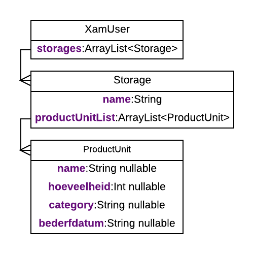

# Project Xam-Xam

## Probleemstelling

Een probleem dat families vaak hebben is dat ze hun voedselvoorraad slecht beheren. Dit zorgt ervoor dat veel alimentaire producten bederven of dat sommige producten zelfs niet gegeten worden. Ook kunnen ze soms geen producten vinden die zij nodig zouden hebben voor een bepaalde gerecht dat zij zouden willen voorbereiden.

## Doel

De doel van mijn app is de gebruiker de mogelijkheid te geven om producten toe te voegen, te wijzigen of te verwijderen. De producten zullen in een opslagplaats geregistreerd worden. Een opslagplaats kan bv. een koelkast of een kast zijn. Op deze opslagplaatsen kan CRUD op worden toegepast. Opgepast met het verwijderen van een opslagplaats want als deze weg is zijn ook alle producten geassocieerde met deze opslagplaats weg.

De producten zullen ook een status hebben gebasseerd of de producten over de bederfdatum zijn of de bederfdatum er zelfs ingedaan is. De statussen zijn: 
* geel: Voor producten waarvan de bederfdatum hetzelfde is als vandaag.
* Groen: niet bederfde producten
* Rood: bederfde producten
Voor producten die niet zouden kunnen bederven zou de gebruiker deze zelfs niet in de app moeten.

## Werking app

In mijn app heb ik 5 fragmenten en voor de authenticatie en database gebruik ik firebase en firebase firestore. Het 1ste fragment is gebruikt voor de login en registratie's van gebruikers. Firebase zal voor dit deel bijna alles doen, met dit bedoel ik dat de UI voor de login en registratie van firebase zal komen. Voor de authenticatie providers heb ik voor google en voor een basis email/passwoord aanpak gekozen. De laatste en minst belangrijkste is een credit dialoog, waarin men de versie van de app kunnen zien wie hem gemaakt heeft of geholpen heeft.

Een keer dat de gebruiker is ingelogd wordt hij verstuurde naar de opslagplaats fragment. In deze fragment kan de gebruiker alle opslagplaatsen zien met het aantal producten dat deze bezit. De opslagplaatsen worden ook getoond in een bepaalde kleur om aan te tonen of er misschien slechte producten zijn. Op deze fragment kan men ook naar de profiel fragment gaan en kunnen de statistieken getoond worden in een dialoogvenster. De gebruiker kan de opslagplaatsen verwijderen door een bepaalde opslagplaats te swipen en de naam veranderen door lang erop te klikken. Om de producten te zien van een opslagplaats moet de gebruiker op een opslagplaats klikken.

In de product fragment worden de producten getoond van een bepaalde opslagplaats. De getoonde producten worden in een bepaalde kleur getoond, deze wordt beslist door hun bederfdatum en de datum van vandaag. De gebruiker kan een product toevoegen en een product verwijderen door er eentje te swipen. Een product kan verandert worden door lang erop te klikken. Ook hierop kan de gebruiker de statistieken bekijken.

In de profiel fragment kan de gebruiker zijn naam, passwoord veranderen en kan zelfs zijn profiel verwijderen. Om toegang te hebben tot deze fragment moet de gebruiker zijn email bevestigen als dit niet gedaan werd dan kan hij kiezen om een bevestigingsmail te sturen. Als de mail bevestigt is, moet de gebruiker voor sommige actie's zich herauthenticeren dit is voor het veranderen zijn passwoord en het verwijderen van zijn profiel.

Wanneer de gebruiker zich authenticeert wordt er ook een service opgestart om zijn producten te analyseren en deze te verwittigen wanneer er slechte zijn. In de notificatie zal de gebruiker ook zien welke opslagplaatsen slechte producten bevatten.

## Scope

### In-scope

De design van de stijl van de app en de firebase backend. De enige staat waarmee er rekening gaat gehouden worden is de bederfbaarheid. Het algemene doel van mijn project is een overzicht te geven welke producten waar zijn opgeslagen zijn en niet hun staat zelf.

### Buiten-scope

Andere parameters als bv hun nutritieve waarden worden niet bijgehouden.

## Technische details

### Native

* Deze app is in Kotlin gemaakt.
* Voor de authenticatie en opslag gebruik ik Firebase en Firebase Firstore.
* App maakt gebruik van: 
    * Fragments
    * Recyclerview
    * Data klasses
    * Meer geavanceerde dialoogvensters
    * Services
    * SearchView om te filteren

### Backend (Firebase)

* Gebruik maken outlook of email als authenticatie provider binnen Firebase.
* Voor de database gebruik ik Firebase Firestore.
* Cloud functions voor het verwijderen en toevoegen van gebruikers, hetzelfde doen voor hun respectieve document.

### Models

Omdat ik als data opslage een document-gefocuste database(Firestore) gebruik, kan ik mijn model klasses deserialiseren/serialiseren met Firestore. Ik heb effectief geen model maar ik heb hier een uml diagram gemaakt met alleen de velden die worden gebruikt voor opslag.

## Deployment (Publiceren van de app)

Als publicatie platform heb ik Amazon app store gekozen, omdat deze gratis is. Bij deze zal ik ook mij logo en een paar screenshots van mijn app publiceren. Omdat ik Firebase gebruikt, zullen alle platformen waarop mijn app geïnstalleerd wordt Google Play Services nodig hebben. Omdat Amazon apparaten dit niet hebben, ga ik deze apparaten niet ondersteunen.

### Amazon app store app beschrijving

This app will provide the ability to register you're food into storages, so that you can find these pretty easy. The food will have the following attributes registered about name, amount, category and peremption date. On each page you will also be able to see the statistics about all the storages and products.The statistics will be about the amount of storages and product, but also about the smallest and biggest peremption date. An inapp service will also analyze the products to see if their are bad products or not.

**DISCLAIMER: This app needs Google Play Services to work wel, because we use firebase for authentication and storage.**

Authors of the different icons:
author for vegetable icon: www.flaticon.com/authors/wanicon
author for grain and dairy icons: www.flaticon.com/authors/pixelmeetup
author for sugar,fat, beans, meat, fish, fruit icons: www.flaticon.com/authors/freepik

### Amazon app store app Kenmerken

* CRUD operations for products
* CRUD operations for storages
* Moving products between storages
* Show statistics about storages page
* Show statistics about a product page
* User can update his name and password of his account
* User can delete his account
* Notification notifying user of storages where bad products lie

### Technische details

* Size: 2.7MB
* Version:
* Developed By: Michael Hertsens
* Application Permissions:
* Access information about networks
    * Open network sockets
    * Minimum Operating System: Android 8.0.0
* Approximate Download Time: Less than 30 seconds

### Publicatie problemen

Ik heb in totaal 9 publicatie pogingen gedaan. Er waren hierbij 2 redenen die elk kwamen. De 1ste reden was dat mijn app crashte wanneer het amazon team mijn app wou testen en de 2de reden was omdat de metadata(beschrijvingen, kenmerken van de app) niet juist was.

1ste reden heb ik opgelost door mijn release versie te debuggen. Ik heb ondervonden dat mijn app vaak crashte door het pakken van de document data van FireStore, dit heb ik opgelost om de variable die deze document pakt te controleren of deze niet null is. De andere ding dat ik heb gedaan is om amazon toestellen eruit te zetten en deze niet te ondersteunen omdat Firebase google services nodig heeft op het toestel. In dit geval hebben amazon toestellen deze niet.

2de reden was omdat de app beschrijving en kenmerken dat ik had geschreven dat deze niet accuraat of juist waren. Ik heb opgelost door mijn kenmerken te bewerken ik had een paar kenmerken die niet hetzelfde waren als in mijn app. Nadat ik dit had gedaan werd mijn app geaccepteerd in de amazon app store.

## Wat heb ik geleerd ?

* Hoe ik een app in amazon app store kan publiceren
* Hoe ik een recyclerview kan filteren wanneer een searchview verandert
* Hoe ik geavanceerde dialoogvensters kan maken en gebruiken
* Hoe ik een snack kan maken laten tonen en een action te implementeren in zijn button
* Hoe ik een service kan laten lopen
* Hoe ik Firebase kan gebruiken voor de authenticatie zijde
* Document-gebasseerde database van Firebase Firestore
* Hoe ik cloud functions(serverless functies) kan gebruiken in mijn firebase backend

## App onderhoud

* Opletten op NullReferenceException, ik heb in mijn code veel niet-null(!!) garanties gezet. Dit is oke voor sommige gevallen maar ik heb hierdoor crashes in mijn app gehad, dus het zou beter zijn om voorzichtig met deze om te gaan.
* Ik zou opletten op de datum en tijdgerelateerde taken, zeker het converteren van string naar datum en van datum to string. Dit is heel belangrijk voor de business logica.
* De filter van de recyclerview is iets dat snel fout kan gaan. Men moet zeker oppassen op de index van items in de recyclerview wanneer deze geklikt zijn, dat deze juist is en geen ArrayOutOfBoundsException.

## App uitbreiden

* Andere backend systeem zoeken, Firebase ondersteurnt alleen smartphones met google play services. Daardoor kunnen wij niet alle Android smartphones bereiken.
* Iconen gebruiken voor opslagplaatsen om deze gemakkelijker te identificeren.
* Meer authenticatie providers toevoegen. Bv: Github, Outlook, gsm, ... enz